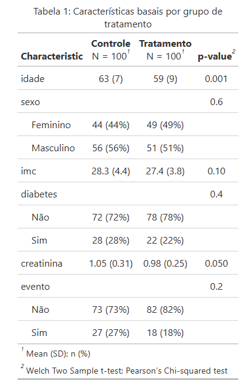
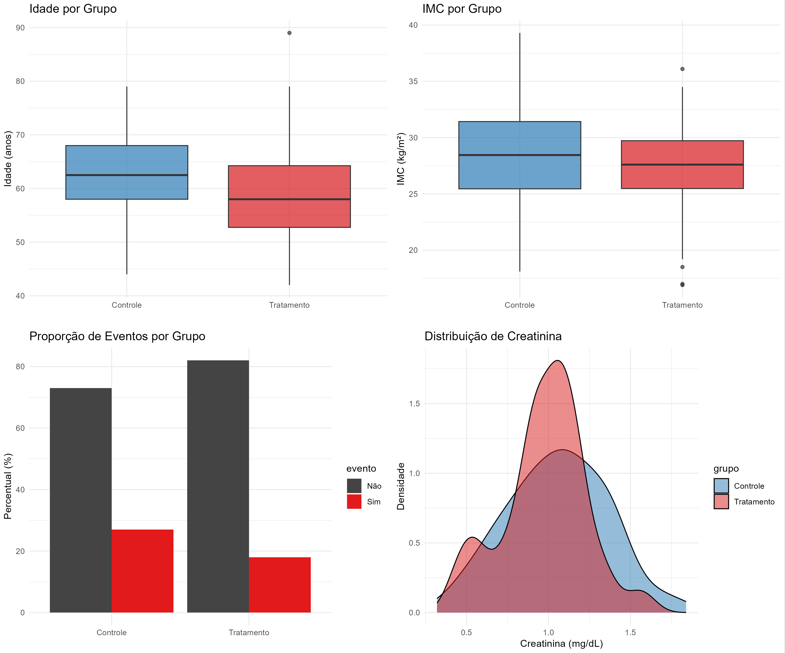
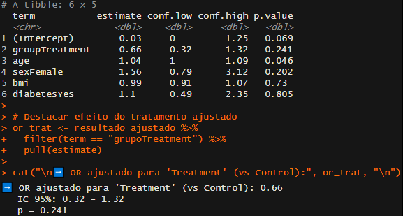

# 🧪 clinical-compare


Uma solução automatizada em **R** para análise comparativa de grupos em estudos clínicos ou epidemiológicos. Gera **Tabela 1**, **gráficos profissionais** e **modelos estatísticos ajustados** — tudo em minutos.

Ideal para ensaios clínicos randomizados, coortes, estudos de eficácia ou qualquer análise que exija caracterização basais com rigor estatístico.

---

## 🔍 O que este projeto oferece?

- 📊 **Tabela 1 pronta para publicação**  
  Comparação automática de variáveis demográficas e clínicas entre grupos (contínuas e categóricas), com testes estatísticos apropriados.
  
- 📈 **Visualizações profissionais**  
  Boxplots, gráficos de barras e densidade para exploração visual de diferenças entre grupos — com cores e estilo adequados para relatórios clínicos ou reuniões com *stakeholders*.

- 📉 **Análise estatística avançada**  
  Regressão logística ajustada para estimar o efeito do grupo (ex: tratamento vs controle) após controle por covariáveis de confusão.

- 🧪 **Dados de exemplo inclusos**  
  Um arquivo Excel simulado (`dados_exemplo.xlsx`) permite testar o fluxo completo sem depender de dados reais.

---

## 🖼️ Exemplo de Saída

### Tabela 1: Características basais por grupo de tratamento



> A tabela é gerada com `gtsummary` + `gt`, com formatação elegante, alinhamento adequado, valores-p em negrito quando significativos e pronta para incluir em relatórios ou manuscritos.

### Gráficos de comparação



Boxplots, gráficos de barras e densidade facilitam a interpretação visual das diferenças entre grupos.

---
## 📉 Resultado da Regressão Logística Ajustada



Após ajuste por idade, sexo, IMC e diabetes, o efeito do tratamento foi estimado como:

```text
OR ajustado para 'Tratamento' (vs Controle): 0.66
(Intervalo de Confiança 95%: 0.32 – 1.32; p = 0.24)

---

## 🚀 Como usar

1. Clone ou baixe este repositório:
   ```bash
   git clone https://github.com/seu-usuario/clinical-compare.git
